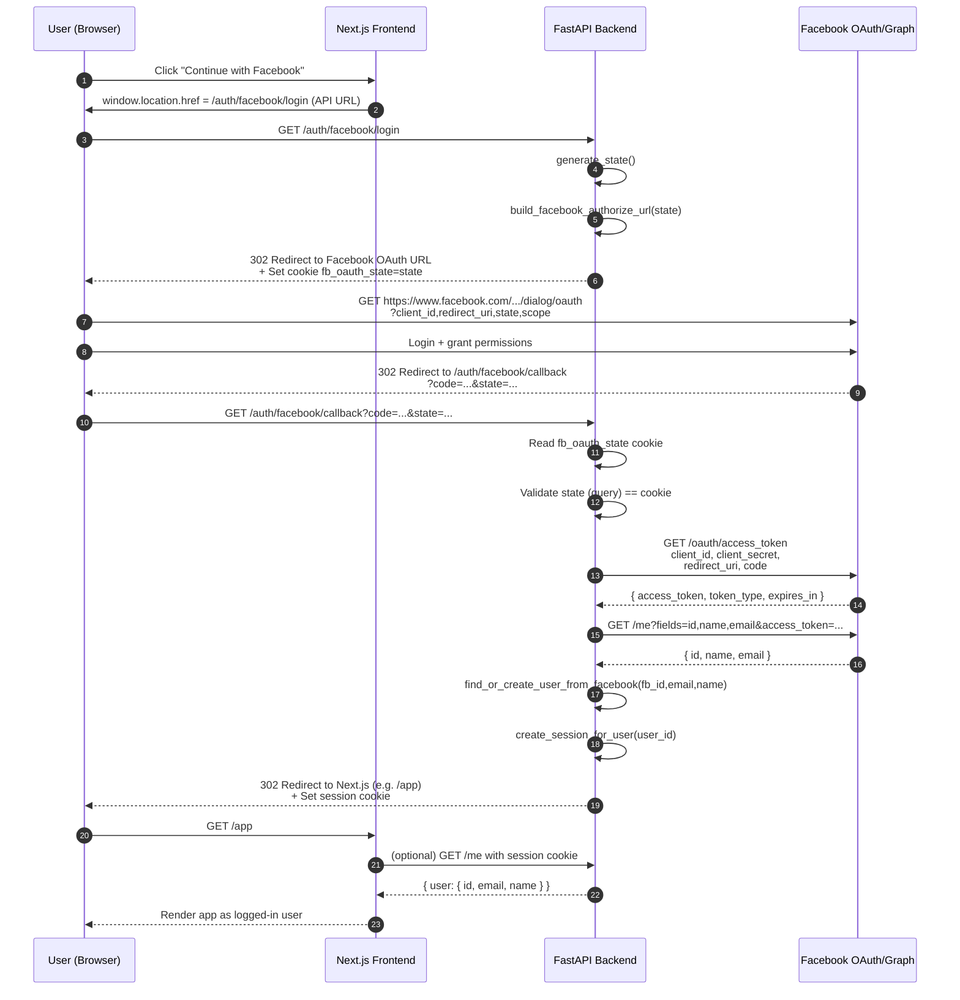

```mermaid
sequenceDiagram
    autonumber
    participant U as User (Browser)
    participant N as Next.js Frontend
    participant A as FastAPI Backend
    participant F as Facebook OAuth/Graph

    %% 1. User clicks "Continue with Facebook"
    U->>N: Click "Continue with Facebook"
    N->>U: window.location.href = /auth/facebook/login (API URL)

    %% 2. Browser hits FastAPI /auth/facebook/login
    U->>A: GET /auth/facebook/login
    A->>A: generate_state()
    A->>A: build_facebook_authorize_url(state)
    A-->>U: 302 Redirect to Facebook OAuth URL<br/>+ Set cookie fb_oauth_state=state

    %% 3. Browser follows redirect to Facebook
    U->>F: GET https://www.facebook.com/.../dialog/oauth<br/>?client_id,redirect_uri,state,scope

    %% 4. User authenticates on Facebook
    U->>F: Login + grant permissions
    F-->>U: 302 Redirect to /auth/facebook/callback<br/>?code=...&state=...

    %% 5. Browser hits callback on FastAPI
    U->>A: GET /auth/facebook/callback?code=...&state=...
    A->>A: Read fb_oauth_state cookie
    A->>A: Validate state (query) == cookie

    %% 6. Exchange code for access token
    A->>F: GET /oauth/access_token<br/>client_id, client_secret,<br/>redirect_uri, code
    F-->>A: { access_token, token_type, expires_in }

    %% 7. Fetch user profile from Facebook
    A->>F: GET /me?fields=id,name,email&access_token=...
    F-->>A: { id, name, email }

    %% 8. Map to local user + create session
    A->>A: find_or_create_user_from_facebook(fb_id,email,name)
    A->>A: create_session_for_user(user_id)
    A-->>U: 302 Redirect to Next.js (e.g. /app)<br/>+ Set session cookie

    %% 9. Frontend loads authenticated page
    U->>N: GET /app
    N->>A: (optional) GET /me with session cookie
    A-->>N: { user: { id, email, name } }
    N-->>U: Render app as logged-in user

```